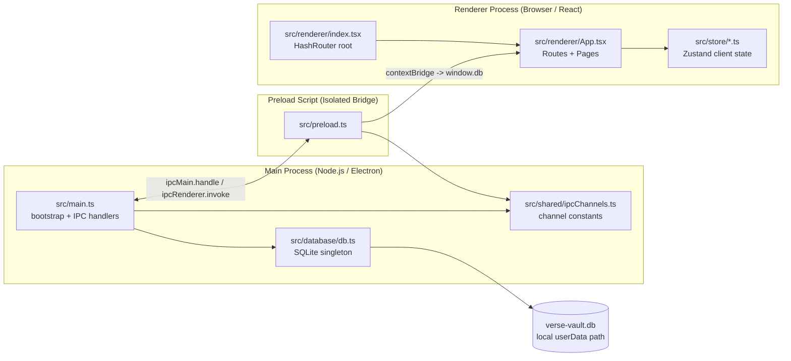

# Architecture

## Product Context

Verse Vault targets a centralized, offline-first desktop workflow for TTRPG campaigns plus creative writing/worldbuilding. The architecture keeps all core data and behavior local, then layers domain modules (campaigns, worlds, manuscripts, sessions) on top of the same process boundaries.

## Process Model

## Rules of the Road

1. **No Node.js in Renderer.** `contextIsolation: true`, `nodeIntegration: false`. All Node/Electron APIs go through preload only.

2. **IPC only through `window.db`.** Never call `ipcRenderer` directly in renderer code. Use the typed API exposed by preload.

3. **DB runs in Main only.** `better-sqlite3` is synchronous and may only be imported in the main process.

4. **Channel names are constants.** All IPC channel strings live in `src/shared/ipcChannels.ts`. No magic strings in `main.ts` or `preload.ts`.

5. **Shared types live in `forge.env.d.ts`.** Current scaffolds are `Verse`, `World`, and `Level` (Level Step 01, 2026-02-27 — types + IPC constants only; handlers/preload/UI not yet wired); Step 03 wires worlds read handlers in `main`, Step 04 exposes worlds read in preload (`window.db.worlds.getAll/getById`), Step 06 adds worlds create in `main`, Step 07 exposes worlds create in preload/UI (`window.db.worlds.add`), Step 08 adds worlds update/delete/mark-viewed handlers in `main`, and Step 09 exposes worlds mutation bridges in preload with renderer edit/delete actions on the worlds home page.

6. **Zustand for client state.** DB/server state flows via `window.db`. Transient UI state goes in feature-focused stores under `src/store/`.

7. **One store per feature domain.** Name files `<feature>Store.ts` and keep them focused.

8. **SQLite is sync; IPC is async.** DB calls in main are synchronous. Renderer calls are Promise-based via `ipcRenderer.invoke`.

9. **Never relax context isolation.** Do not set `contextIsolation: false` or `nodeIntegration: true`.

10. **Fuses are compile-time.** Security fuses in `forge.config.ts` are baked at `yarn make`, not `yarn start`.

11. **Offline-first is a hard requirement.** New domain features must work without network access and persist locally first.

## Current Data Bootstrap Notes

- `src/database/db.ts -> initializeSchema()` currently creates both `verses` and `worlds` via `CREATE TABLE IF NOT EXISTS` for migration-safe startup on existing user databases.
- `worlds` schema baseline (Step 02, 2026-02-26): `id`, `name`, `thumbnail`, `short_description`, `last_viewed_at`, `created_at`, `updated_at`.
- `src/main.ts -> registerIpcHandlers()` currently includes worlds read handlers (`WORLDS_GET_ALL`, `WORLDS_GET_BY_ID`), create handler (`WORLDS_ADD` with required trimmed-name validation), and mutation handlers (`WORLDS_UPDATE`, `WORLDS_DELETE`, `WORLDS_MARK_VIEWED`).
- `src/preload.ts` currently exposes worlds read/create/mutation bridge methods `window.db.worlds.getAll()`, `window.db.worlds.getById(id)`, `window.db.worlds.add(data)`, `window.db.worlds.update(id, data)`, `window.db.worlds.delete(id)`, and `window.db.worlds.markViewed(id)`.
- `src/renderer/pages/WorldsHomePage.tsx` now includes create and edit modal flows plus delete actions from world cards; successful create/update operations upsert the returned world in local page state, and delete removes it immediately after confirmation.
