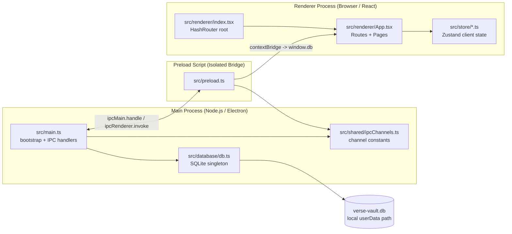

# Architecture

## Product Context

Verse Vault targets a centralized, offline-first desktop workflow for TTRPG campaigns plus creative writing/worldbuilding. The architecture keeps all core data and behavior local, then layers domain modules (campaigns, worlds, manuscripts, sessions) on top of the same process boundaries.

## Process Model

## Rules of the Road

1. **No Node.js in Renderer.** `contextIsolation: true`, `nodeIntegration: false`. All Node/Electron APIs go through preload only.

2. **IPC only through `window.db`.** Never call `ipcRenderer` directly in renderer code. Use the typed API exposed by preload.

3. **DB runs in Main only.** `better-sqlite3` is synchronous and may only be imported in the main process.

4. **Channel names are constants.** All IPC channel strings live in `src/shared/ipcChannels.ts`. No magic strings in `main.ts` or `preload.ts`. Abilities Step 05 (2026-02-27) wires main-process handlers for read + core mutations + child-link mutations (`ABILITIES_GET_ALL_BY_WORLD`, `ABILITIES_GET_BY_ID`, `ABILITIES_ADD`, `ABILITIES_UPDATE`, `ABILITIES_DELETE`, `ABILITIES_ADD_CHILD`, `ABILITIES_REMOVE_CHILD`, `ABILITIES_GET_CHILDREN`); Step 06 wires preload read bridges (`getAllByWorld/getById/getChildren`); Step 07 wires preload mutation bridges (`add/update/delete/addChild/removeChild`). Campaign Step 01 (2026-02-27) adds constants for campaign flows (`CAMPAIGNS_GET_ALL_BY_WORLD`, `CAMPAIGNS_GET_BY_ID`, `CAMPAIGNS_ADD`, `CAMPAIGNS_UPDATE`, `CAMPAIGNS_DELETE`); Campaign Step 07 (2026-02-27) wires these handlers in `main`; Step 10 (2026-02-28) wires preload bridges (`window.db.campaigns.getAllByWorld/getById/add/update/delete`). BattleMap Step 01 (2026-03-03) adds constants for BattleMap flows (`BATTLEMAPS_GET_ALL_BY_WORLD`, `BATTLEMAPS_GET_BY_ID`, `BATTLEMAPS_ADD`, `BATTLEMAPS_UPDATE`, `BATTLEMAPS_DELETE`) with handler and preload wiring deferred to later steps. Session Step 02 (2026-02-27) adds constants for session flows (`SESSIONS_GET_ALL_BY_CAMPAIGN`, `SESSIONS_GET_BY_ID`, `SESSIONS_ADD`, `SESSIONS_UPDATE`, `SESSIONS_DELETE`); Session Step 08 (2026-02-27) wires these handlers in `main`; Step 10 (2026-02-28) wires preload bridges (`window.db.sessions.getAllByCampaign/getById/add/update/delete`). Scene Step 03 (2026-02-27) adds constants for scene flows (`SCENES_GET_ALL_BY_SESSION`, `SCENES_GET_BY_ID`, `SCENES_ADD`, `SCENES_UPDATE`, `SCENES_DELETE`); Scene Step 09 (2026-02-27) wires these handlers in `main`; Step 10 (2026-02-28) wires preload bridges (`window.db.scenes.getAllBySession/getById/add/update/delete`); Scenes Move Step 01 (2026-03-03) adds `SCENES_MOVE_TO_SESSION` with `window.db.scenes.moveTo(sceneId, newSessionId)`; Campaign Scenes Index Step 01 (2026-03-03) adds `SCENES_GET_ALL_BY_CAMPAIGN` with `window.db.scenes.getAllByCampaign(campaignId)`.

5. **Shared types live in `forge.env.d.ts`.** Current shared contracts are `Verse`, `World`, `Level`, `Ability`, `AbilityChild`, `Campaign`, `Arc`, `Act`, `Session`, `Scene`, and `CampaignSceneListItem`; `DbApi` exposes renderer-safe bridges for verses/worlds/levels, all ability reads/mutations (`window.db.abilities.getAllByWorld/getById/add/update/delete/addChild/removeChild/getChildren`), and all campaign/arc/act/session/scene CRUD (`window.db.campaigns.getAllByWorld/getById/add/update/delete`, `window.db.arcs.getAllByCampaign/getById/add/update/delete`, `window.db.acts.getAllByArc/getAllByCampaign/getById/add/update/delete/moveTo`, `window.db.sessions.getAllByAct/getById/add/update/delete/moveTo`, `window.db.scenes.getAllByCampaign/getAllBySession/getById/add/update/delete/moveTo`). Step 03 wires worlds read handlers in `main`, Step 04 exposes worlds read in preload (`window.db.worlds.getAll/getById`), Step 06 adds worlds create in `main`, Step 07 exposes worlds create in preload/UI (`window.db.worlds.add`), Step 08 adds worlds update/delete/mark-viewed handlers in `main`, and Step 09 exposes worlds mutation bridges in preload with renderer edit/delete actions on the worlds home page. Campaign/Session/Scene shared type contracts (`Campaign`, `Session`, `Scene` interfaces and `DbApi.campaigns/sessions/scenes` signatures) added in Step 11 (2026-02-28). Arc/Act shared type contracts (`Arc`, `Act` interfaces and `DbApi.arcs/acts` signatures; `Session.act_id` replaces `Session.campaign_id`) added in Arc/Act Step 01 (2026-02-28). Session planned date-time Step 01 (2026-03-03) extends `Session` and `DbApi.sessions.add/update` with nullable `planned_at`. Campaign Scenes Index Step 01 (2026-03-03) adds `CampaignSceneListItem` and `DbApi.scenes.getAllByCampaign`.

6. **Zustand for client state.** DB/server state flows via `window.db`. Transient UI state goes in feature-focused stores under `src/store/`.

7. **One store per feature domain.** Name files `<feature>Store.ts` and keep them focused.

8. **SQLite is sync; IPC is async.** DB calls in main are synchronous. Renderer calls are Promise-based via `ipcRenderer.invoke`.

9. **Never relax context isolation.** Do not set `contextIsolation: false` or `nodeIntegration: true`.

10. **Fuses are compile-time.** Security fuses in `forge.config.ts` are baked at `yarn make`, not `yarn start`.

11. **Offline-first is a hard requirement.** New domain features must work without network access and persist locally first.

## Current Data Bootstrap Notes

- `src/database/db.ts -> initializeSchema()` currently creates `verses`, `worlds`, `levels`, `campaigns`, `battlemaps`, `arcs`, `acts`, `sessions`, `scenes`, `abilities`, and `ability_children` via `CREATE TABLE IF NOT EXISTS` for migration-safe startup on existing user databases. A `runArcActMigration()` call at the end of `initializeSchema` detects whether `sessions` still has `campaign_id` and, if so, auto-migrates: creates one Arc 1 + Act 1 per campaign and remaps all existing sessions to the new `act_id` FK (the hierarchy now is `World > Campaign > Arc > Act > Session > Scene`). Session planned date-time Step 01 (2026-03-03) adds `runSessionPlannedAtMigration()` to safely add nullable `sessions.planned_at` on existing databases when missing.
- `worlds` schema baseline (Step 02, 2026-02-26): `id`, `name`, `thumbnail`, `short_description`, `last_viewed_at`, `created_at`, `updated_at`.
- `levels` schema baseline (Step 02, 2026-02-27): `id`, `world_id` (FK -> worlds), `name`, `category`, `description`, `created_at`, `updated_at`.
- `campaigns` schema baseline (Step 04, 2026-02-27): `id`, `world_id` (FK -> worlds, `ON DELETE CASCADE`), `name`, `summary`, `config` (default '{}'), `created_at`, `updated_at`.
- BattleMap Step 01 (2026-03-03): `battlemaps` schema baseline is `id`, `world_id` (FK -> worlds, `ON DELETE CASCADE`), `name`, `config` (default '{}'), `created_at`, `updated_at`.
- `arcs` schema baseline (Arc/Act Step 01, 2026-02-28): `id`, `campaign_id` (FK -> campaigns, `ON DELETE CASCADE`), `name`, `sort_order` (default `0`), `created_at`, `updated_at`.
- `acts` schema baseline (Arc/Act Step 01, 2026-02-28): `id`, `arc_id` (FK -> arcs, `ON DELETE CASCADE`), `name`, `sort_order` (default `0`), `created_at`, `updated_at`.
- Session planned date-time Step 01 (2026-03-03): `sessions` schema now includes nullable `planned_at` (`TEXT`) with additive migration for existing databases.
- `sessions` schema baseline (Step 05, 2026-02-27; migrated Arc/Act Step 01, 2026-02-28): `id`, `act_id` (FK -> acts, `ON DELETE CASCADE`; migrated from `campaign_id` FK -> campaigns — existing rows auto-migrated to a generated Arc 1 / Act 1 per campaign), `name`, `notes`, `sort_order` (default `0`), `created_at`, `updated_at`.
- `scenes` schema baseline (Step 06, 2026-02-27): `id`, `session_id` (FK -> sessions, `ON DELETE CASCADE`), `name`, `notes`, `payload` (default '{}'), `sort_order` (default `0`), `created_at`, `updated_at`; `payload` is a skeleton JSON container for future map/token/clock/rules state.
- `abilities` schema baseline (Step 02, 2026-02-27): `id`, `world_id` (FK -> worlds, `ON DELETE CASCADE`), `name`, `description`, `type` (`CHECK` in `active|passive`), `passive_subtype` (`NULL` or `linchpin|keystone|rostering`), `level_id` (FK -> levels, `ON DELETE SET NULL`), `effects` (default '[]'), `conditions` (default '[]'), `cast_cost` (default '{}'), `trigger`, `pick_count`, `pick_timing` (`CHECK` in `obtain|rest`), `pick_is_permanent` (default `0`), `created_at`, `updated_at`.
- `ability_children` schema baseline (Step 02, 2026-02-27): `id`, `parent_id` (FK -> abilities, `ON DELETE CASCADE`), `child_id` (FK -> abilities, `ON DELETE CASCADE`), `UNIQUE(parent_id, child_id)`.
- `src/main.ts -> registerIpcHandlers()` currently includes worlds read handlers (`WORLDS_GET_ALL`, `WORLDS_GET_BY_ID`), create handler (`WORLDS_ADD` with required trimmed-name validation), and mutation handlers (`WORLDS_UPDATE`, `WORLDS_DELETE`, `WORLDS_MARK_VIEWED`); plus levels read handlers (`LEVELS_GET_ALL_BY_WORLD`, `LEVELS_GET_BY_ID`) added in Level Step 03 (2026-02-27); plus levels mutation handlers (`LEVELS_ADD`, `LEVELS_UPDATE`, `LEVELS_DELETE`) added in Level Step 05 (2026-02-27) - `LEVELS_ADD` validates name + category, inserts and returns the row; `LEVELS_UPDATE` does partial field updates via `hasOwnProperty` checks and always sets `updated_at`; `LEVELS_DELETE` removes by id and returns `{ id }`; plus campaign handlers (`CAMPAIGNS_GET_ALL_BY_WORLD`, `CAMPAIGNS_GET_BY_ID`, `CAMPAIGNS_ADD`, `CAMPAIGNS_UPDATE`, `CAMPAIGNS_DELETE`) added in Campaign Step 07 (2026-02-27), where add validates required trimmed `name`, update uses `hasOwnProperty` partial updates for `name`/`summary`/`config` and refreshes `updated_at`, and delete remains idempotent by returning `{ id }`; plus arc handlers (`ARCS_GET_ALL_BY_CAMPAIGN`, `ARCS_GET_BY_ID`, `ARCS_ADD`, `ARCS_UPDATE`, `ARCS_DELETE`) and act handlers (`ACTS_GET_ALL_BY_ARC`, `ACTS_GET_ALL_BY_CAMPAIGN`, `ACTS_GET_BY_ID`, `ACTS_ADD`, `ACTS_UPDATE`, `ACTS_DELETE`, `ACTS_MOVE_TO_ARC`) added in Arc/Act Step 01 (2026-02-28); plus session handlers (`SESSIONS_GET_ALL_BY_ACT`, `SESSIONS_GET_BY_ID`, `SESSIONS_ADD`, `SESSIONS_UPDATE`, `SESSIONS_DELETE`, `SESSIONS_MOVE_TO_ACT`) — originally added in Session Step 08 (2026-02-27) as `SESSIONS_GET_ALL_BY_CAMPAIGN`; handler updated in Arc/Act Step 01 to use `act_id` scope — list reads ordered by `sort_order ASC, id ASC`, add appends to the sibling tail when `sort_order` is omitted, update uses `hasOwnProperty` partial updates and refreshes `updated_at`, delete compacts remaining sibling `sort_order` values inside the same `act_id`; plus scene handlers (`SCENES_GET_ALL_BY_CAMPAIGN`, `SCENES_GET_ALL_BY_SESSION`, `SCENES_GET_BY_ID`, `SCENES_ADD`, `SCENES_UPDATE`, `SCENES_DELETE`, `SCENES_MOVE_TO_SESSION`) added in Scene Step 09 (2026-02-27) + Scenes Move Step 01 (2026-03-03) + Campaign Scenes Index Step 01 (2026-03-03), where campaign-scoped reads join `scenes -> sessions -> acts -> arcs`, filter by `arcs.campaign_id`, and order by `arc/act/session/scene sort_order` with id tie-breakers; session-scoped list reads are ordered by persisted `sort_order ASC, id ASC`, add validates required trimmed `name`, defaults omitted `payload` to `'{}'`, validates provided `payload` as JSON text, and appends to the sibling tail when `sort_order` is omitted, update uses explicit `hasOwnProperty` checks for `name`/`notes`/`payload`/`sort_order` with validation and always refreshes `updated_at`, delete remains idempotent by returning `{ id }` while compacting remaining sibling `sort_order` values inside the same `session_id`, and move-to-session validates source scene + target session, no-ops when session is unchanged, appends moved scene at the target tail, and resequences the old session; plus abilities read handlers (`ABILITIES_GET_ALL_BY_WORLD`, `ABILITIES_GET_BY_ID`, `ABILITIES_GET_CHILDREN`) added in Ability Step 03 (2026-02-27), with list reads ordered by `updated_at DESC`; plus abilities core mutation handlers (`ABILITIES_ADD`, `ABILITIES_UPDATE`, `ABILITIES_DELETE`) added in Ability Step 04 (2026-02-27), where add/update validate trimmed required fields (`name`, `type`), update uses explicit `hasOwnProperty` checks for partial/null-safe field updates, and delete returns `{ id }`; plus abilities child-link handlers (`ABILITIES_ADD_CHILD`, `ABILITIES_REMOVE_CHILD`) added in Ability Step 05 (2026-02-27), where add-child rejects self-links/cross-world links and converts duplicate unique-constraint errors into a clear domain error, while remove-child remains idempotent.
- `src/preload.ts` currently exposes worlds read/create/mutation bridge methods `window.db.worlds.getAll()`, `window.db.worlds.getById(id)`, `window.db.worlds.add(data)`, `window.db.worlds.update(id, data)`, `window.db.worlds.delete(id)`, and `window.db.worlds.markViewed(id)`; plus levels read bridge methods `window.db.levels.getAllByWorld(worldId)` and `window.db.levels.getById(id)` added in Level Step 04 (2026-02-27); plus levels mutation bridge methods `window.db.levels.add(data)`, `window.db.levels.update(id, data)`, and `window.db.levels.delete(id)` added in Level Step 06 (2026-02-27); plus abilities read bridge methods `window.db.abilities.getAllByWorld(worldId)`, `window.db.abilities.getById(id)`, and `window.db.abilities.getChildren(abilityId)` added in Ability Step 06 (2026-02-27); plus abilities mutation bridge methods `window.db.abilities.add(data)`, `window.db.abilities.update(id, data)`, `window.db.abilities.delete(id)`, `window.db.abilities.addChild(data)`, and `window.db.abilities.removeChild(data)` added in Ability Step 07 (2026-02-27); plus campaign bridge methods `window.db.campaigns.getAllByWorld(worldId)`, `window.db.campaigns.getById(id)`, `window.db.campaigns.add(data)`, `window.db.campaigns.update(id, data)`, and `window.db.campaigns.delete(id)` added in Step 10 (2026-02-28); plus arc bridge methods `window.db.arcs.getAllByCampaign(campaignId)`, `window.db.arcs.getById(id)`, `window.db.arcs.add(data)`, `window.db.arcs.update(id, data)`, and `window.db.arcs.delete(id)` added in Arc/Act Step 01 (2026-02-28); plus act bridge methods `window.db.acts.getAllByArc(arcId)`, `window.db.acts.getAllByCampaign(campaignId)`, `window.db.acts.getById(id)`, `window.db.acts.add(data)`, `window.db.acts.update(id, data)`, `window.db.acts.delete(id)`, and `window.db.acts.moveTo(actId, newArcId)` added in Arc/Act Step 01 (2026-02-28); plus session bridge methods `window.db.sessions.getAllByAct(actId)`, `window.db.sessions.getById(id)`, `window.db.sessions.add(data)`, `window.db.sessions.update(id, data)`, `window.db.sessions.delete(id)`, and `window.db.sessions.moveTo(sessionId, newActId)` (updated from `getAllByCampaign` in Arc/Act Step 01, 2026-02-28); plus scene bridge methods `window.db.scenes.getAllByCampaign(campaignId)`, `window.db.scenes.getAllBySession(sessionId)`, `window.db.scenes.getById(id)`, `window.db.scenes.add(data)`, `window.db.scenes.update(id, data)`, `window.db.scenes.delete(id)`, and `window.db.scenes.moveTo(sceneId, newSessionId)` (campaign-scoped read added in Campaign Scenes Index Step 01, 2026-03-03; move added in Scenes Move Step 01, 2026-03-03).
- `src/shared/ipcChannels.ts` includes abilities channel constants for Step 01 (`ABILITIES_GET_ALL_BY_WORLD`, `ABILITIES_GET_BY_ID`, `ABILITIES_ADD`, `ABILITIES_UPDATE`, `ABILITIES_DELETE`, `ABILITIES_ADD_CHILD`, `ABILITIES_REMOVE_CHILD`, `ABILITIES_GET_CHILDREN`); Ability Step 03 wires read channels in `main`, Step 04 wires core mutation channels in `main`, Step 05 wires child-link mutation channels in `main`, Step 06 wires read bridges in preload (`window.db.abilities.getAllByWorld/getById/getChildren`), and Step 07 wires mutation bridges in preload (`window.db.abilities.add/update/delete/addChild/removeChild`).
- `src/shared/ipcChannels.ts` includes campaign channel constants added in Campaign Step 01 (2026-02-27): `CAMPAIGNS_GET_ALL_BY_WORLD`, `CAMPAIGNS_GET_BY_ID`, `CAMPAIGNS_ADD`, `CAMPAIGNS_UPDATE`, and `CAMPAIGNS_DELETE`; Campaign Step 07 wires these handlers in `main`; Step 10 (2026-02-28) wires preload bridges via `window.db.campaigns`.
- `src/shared/ipcChannels.ts` includes BattleMap channel constants added in BattleMap Step 01 (2026-03-03): `BATTLEMAPS_GET_ALL_BY_WORLD`, `BATTLEMAPS_GET_BY_ID`, `BATTLEMAPS_ADD`, `BATTLEMAPS_UPDATE`, and `BATTLEMAPS_DELETE`; runtime handlers and preload bridge methods are intentionally deferred in this step.
- `src/shared/ipcChannels.ts` includes session channel constants added in Session Step 02 (2026-02-27): `SESSIONS_GET_ALL_BY_CAMPAIGN` (deprecated, kept for renderer compat until Step 02), `SESSIONS_GET_BY_ID`, `SESSIONS_ADD`, `SESSIONS_UPDATE`, and `SESSIONS_DELETE`; Session Step 08 wires these handlers in `main`; Step 10 (2026-02-28) wires preload bridges via `window.db.sessions`; Arc/Act Step 01 (2026-02-28) adds `SESSIONS_GET_ALL_BY_ACT` and `SESSIONS_MOVE_TO_ACT` (replaces `SESSIONS_GET_ALL_BY_CAMPAIGN` handler in main), plus Arc constants (`ARCS_GET_ALL_BY_CAMPAIGN`, `ARCS_GET_BY_ID`, `ARCS_ADD`, `ARCS_UPDATE`, `ARCS_DELETE`) and Act constants (`ACTS_GET_ALL_BY_ARC`, `ACTS_GET_ALL_BY_CAMPAIGN`, `ACTS_GET_BY_ID`, `ACTS_ADD`, `ACTS_UPDATE`, `ACTS_DELETE`, `ACTS_MOVE_TO_ARC`).
- `src/shared/ipcChannels.ts` includes scene channel constants added in Scene Step 03 (2026-02-27): `SCENES_GET_ALL_BY_SESSION`, `SCENES_GET_BY_ID`, `SCENES_ADD`, `SCENES_UPDATE`, and `SCENES_DELETE`; Scene Step 09 wires these handlers in `main`; Step 10 (2026-02-28) wires preload bridges via `window.db.scenes`; Campaign Scenes Index Step 01 (2026-03-03) adds `SCENES_GET_ALL_BY_CAMPAIGN`; Scenes Move Step 01 (2026-03-03) adds `SCENES_MOVE_TO_SESSION`.
- `src/renderer/pages/WorldsHomePage.tsx` now includes create and edit modal flows plus delete actions from world cards; successful create/update operations upsert the returned world in local page state, and delete removes it immediately after confirmation.
