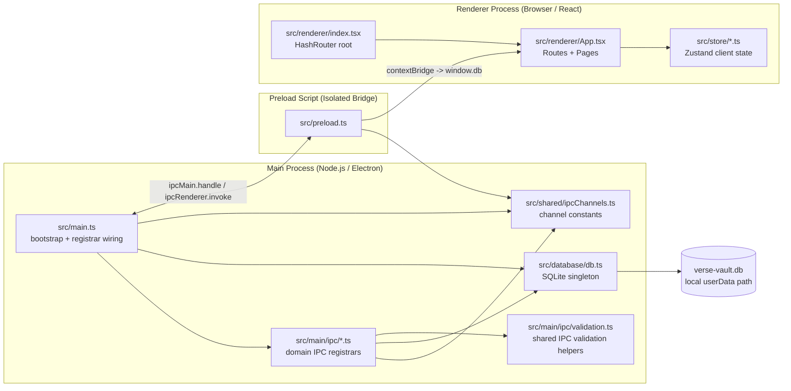

# Architecture

## Product Context

Verse Vault is a centralized, offline-first desktop app for TTRPG campaigns plus creative writing/worldbuilding.

Use this file for durable rules and schema shape. For current seams, routes, registrars, and IPC mappings, prefer `docs/02_CODEBASE_MAP.md` and `docs/03_IPC_CONTRACT.md`.

## Process Model

```mermaid
flowchart LR
    subgraph Main["Main Process (Node.js / Electron)"]
        M[src/main.ts\nbootstrap + registrar wiring]
        IPCREG[src/main/ipc/*.ts\ndomain IPC registrars]
        VAL[src/main/ipc/validation.ts\nshared IPC validation helpers]
        DB[src/database/db.ts\nSQLite singleton]
        CH[src/shared/ipcChannels.ts\nchannel constants]
        M --> IPCREG
        M --> DB
        M --> CH
        IPCREG --> CH
        IPCREG --> DB
        IPCREG --> VAL
    end

    subgraph Preload["Preload Script (Isolated Bridge)"]
        P[src/preload.ts]
        P --> CH
    end

    subgraph Renderer["Renderer Process (Browser / React)"]
        I[src/renderer/index.tsx\nHashRouter root]
        App[src/renderer/App.tsx\nRoutes + Pages]
        Store[src/store/*.ts\nZustand client state]
        I --> App
        App --> Store
    end

    M <-->|ipcMain.handle / ipcRenderer.invoke| P
    P -->|contextBridge -> window.db| App
    DB --> SQLite[(verse-vault.db\nlocal userData path)]
```

## Rules of the Road

1. **No Node.js in Renderer.** `contextIsolation: true`, `nodeIntegration: false`. All Node/Electron APIs go through preload only. ESLint `no-restricted-imports` enforces this at lint time: importing `electron` directly in any `src/renderer/**` file is an error.

2. **IPC only through `window.db`.** Never call `ipcRenderer` directly in renderer code. Use the typed API exposed by preload.

3. **DB runs in Main only.** `better-sqlite3` is synchronous and may only be imported in the main process. ESLint `import/no-restricted-paths` enforces this at lint time: renderer files cannot import from `src/main.ts`, `src/main/**`, or `src/database/**`. Preload cannot import from `src/renderer/**`. `src/shared/**` and `forge.env.d.ts` are unrestricted and importable from all layers.

4. **Channel names are constants.** All IPC channel strings live in `src/shared/ipcChannels.ts`. No magic strings in `main.ts` or `preload.ts`. See `docs/03_IPC_CONTRACT.md` for the generated channel-to-handler index and `docs/features/*.md` for per-domain channel lists.

5. **Shared types live in `forge.env.d.ts`.** Renderer-safe contracts and the `DbApi` bridge surface are defined there. See `docs/03_IPC_CONTRACT.md` and `docs/features/*.md` for current per-domain field/method lists.

6. **Zustand for client state.** DB/server state flows via `window.db`. Transient UI state goes in feature-focused stores under `src/store/`.

7. **One store per feature domain.** Name files `<feature>Store.ts` and keep them focused.

8. **SQLite is sync; IPC is async.** DB calls in main are synchronous. Renderer calls are Promise-based via `ipcRenderer.invoke`.

9. **Never relax context isolation.** Do not set `contextIsolation: false` or `nodeIntegration: true`.

10. **Fuses are compile-time.** Security fuses in `forge.config.ts` are baked at `yarn make`, not `yarn start`.

11. **Defensive asar filtering.** Package-time ignore rules live in `forge.ignore.ts` and enumerate only the runtime-required node_modules (currently `better-sqlite3` and `electron-squirrel-startup`). This defensive stance prevents accidental dep misclassifications from inflating the asar, even if `prune: true` fails to strip devDependencies.

12. **Offline-first is a hard requirement.** New domain features must work without network access and persist locally first.

13. **Code formatting with dprint.** Project uses dprint (Rust-based formatter) for consistent code style across TypeScript/JSON/Markdown files. Run `yarn format:check` before commits and `yarn format` to auto-fix. Configuration lives in `dprint.json`.

14. **File-size and complexity budgets enforced by ESLint.** `.eslintrc.cjs` enforces the following budgets to prevent unchecked monolithic growth:
    - `max-lines ≤ 400` for all `src/**` files (error).
    - `max-lines ≤ 600` for all `tests/**` files (error).
    - `max-lines-per-function ≤ 80` for non-React utility/lib code (error); React components and test callbacks are exempt via broad pattern overrides.
    - `complexity ≤ 15` for all files (error).
      Existing files that exceed these budgets have documented per-file `overrides` entries with `// TODO: remove override after <feature>` comments so they are tracked for future removal. The ESLint config is `.eslintrc.cjs` (converted from `.eslintrc.json` to support inline comments).

## Current Schema Summary

Startup runs `initializeSchema()` in `src/database/db.ts`, which creates all tables via
`CREATE TABLE IF NOT EXISTS` and applies additive, idempotent migrations for legacy
databases (column backfills, FK introductions, index creation). See
`src/database/db.ts` for the current migration list — do not narrate migration history
here; git history and `docs/features/*.md` cover how the schema got here.

| Table                           | Key Columns / FKs                                                                                                                                                                                                                                                                                                                                                                                                                                                                                                                                                                               | Notes                                                                                                   |
| ------------------------------- | ----------------------------------------------------------------------------------------------------------------------------------------------------------------------------------------------------------------------------------------------------------------------------------------------------------------------------------------------------------------------------------------------------------------------------------------------------------------------------------------------------------------------------------------------------------------------------------------------- | ------------------------------------------------------------------------------------------------------- |
| `verses`                        | `id`, `text`, `reference`, `tags`, `created_at`, `updated_at`                                                                                                                                                                                                                                                                                                                                                                                                                                                                                                                                   |                                                                                                         |
| `worlds`                        | `id`, `name`, `thumbnail`, `short_description`, `last_viewed_at`, `config` (default `'{}'`), `created_at`, `updated_at`                                                                                                                                                                                                                                                                                                                                                                                                                                                                         |                                                                                                         |
| `levels`                        | `id`, `world_id` (FK -> worlds, `ON DELETE CASCADE`), `name`, `category`, `description`, `created_at`, `updated_at`                                                                                                                                                                                                                                                                                                                                                                                                                                                                             |                                                                                                         |
| `campaigns`                     | `id`, `world_id` (FK -> worlds, `ON DELETE CASCADE`), `name`, `summary`, `config` (default `'{}'`), `created_at`, `updated_at`                                                                                                                                                                                                                                                                                                                                                                                                                                                                  |                                                                                                         |
| `battlemaps`                    | `id`, `world_id` (FK -> worlds, `ON DELETE CASCADE`), `name`, `config` (default `'{}'`), `created_at`, `updated_at`                                                                                                                                                                                                                                                                                                                                                                                                                                                                             | `config` holds runtime grid/map/camera state.                                                           |
| `tokens`                        | `id`, `world_id` (FK -> worlds, `ON DELETE CASCADE`), `campaign_id` (nullable FK -> campaigns, `ON DELETE CASCADE`), `grid_type` (`CHECK` in `square\|hex`, default `'square'`), `name`, `image_src`, `config` (default `'{}'`), `is_visible` (0/1, default `1`), `created_at`, `updated_at`                                                                                                                                                                                                                                                                                                    | Scoped to a world, optionally to a campaign within it. Indexed on `world_id` and `campaign_id`.         |
| `arcs`                          | `id`, `campaign_id` (FK -> campaigns, `ON DELETE CASCADE`), `name`, `sort_order` (default `0`), `created_at`, `updated_at`                                                                                                                                                                                                                                                                                                                                                                                                                                                                      |                                                                                                         |
| `acts`                          | `id`, `arc_id` (FK -> arcs, `ON DELETE CASCADE`), `name`, `sort_order` (default `0`), `created_at`, `updated_at`                                                                                                                                                                                                                                                                                                                                                                                                                                                                                |                                                                                                         |
| `sessions`                      | `id`, `act_id` (FK -> acts, `ON DELETE CASCADE`), `name`, `notes`, `planned_at` (nullable), `sort_order` (default `0`), `created_at`, `updated_at`                                                                                                                                                                                                                                                                                                                                                                                                                                              | Hierarchy is `World > Campaign > Arc > Act > Session > Scene`.                                          |
| `scenes`                        | `id`, `session_id` (FK -> sessions, `ON DELETE CASCADE`), `name`, `notes`, `payload` (default `'{}'`), `sort_order` (default `0`), `created_at`, `updated_at`                                                                                                                                                                                                                                                                                                                                                                                                                                   | `payload` is a JSON container for map/token/clock/rules state, including `runtime.battlemap_id`.        |
| `abilities`                     | `id`, `world_id` (FK -> worlds, `ON DELETE CASCADE`), `name`, `description`, `type` (`CHECK` in `active\|passive`), `passive_subtype` (`NULL\|linchpin\|keystone\|rostering`), `level_id` (FK -> levels, `ON DELETE SET NULL`), `effects` (default `'[]'`), `conditions` (default `'[]'`), `cast_cost` (default `'{}'`), `trigger`, `pick_count`, `pick_timing` (`CHECK` in `obtain\|rest`), `pick_is_permanent` (default `0`), `range_cells`, `aoe_shape` (`CHECK` in `circle\|rectangle\|cone\|line`), `aoe_size_cells`, `target_type` (`CHECK` in `tile\|token`), `created_at`, `updated_at` | Range/shape/target columns are nullable and only meaningful for `type = 'active'`.                      |
| `ability_children`              | `id`, `parent_id` (FK -> abilities, `ON DELETE CASCADE`), `child_id` (FK -> abilities, `ON DELETE CASCADE`), `UNIQUE(parent_id, child_id)`                                                                                                                                                                                                                                                                                                                                                                                                                                                      |                                                                                                         |
| `characters`                    | `id`, `world_id` (FK -> worlds, `ON DELETE CASCADE`), `name`, `profile`, `image_src`, `sections` (default `'{}'`), `wiki_summary` (default `'{}'`), `created_at`, `updated_at`                                                                                                                                                                                                                                                                                                                                                                                                                  | World-scoped wiki entity; full CRUD. See `docs/features/characters.md`.                                 |
| `statblocks`                    | `id`, `world_id` (FK -> worlds, `ON DELETE CASCADE`), `campaign_id` (nullable FK -> campaigns), `character_id` (nullable FK -> characters), `name`, `description`, `default_token_id` (nullable FK -> tokens, `ON DELETE SET NULL`), `config` (default `'{}'`), `created_at`, `updated_at`                                                                                                                                                                                                                                                                                                      | Indexed on `world_id`, `campaign_id`, `character_id`, `default_token_id`.                               |
| `statblock_token_links`         | `id`, `statblock_id` (FK -> statblocks, `ON DELETE CASCADE`), `token_id` (FK -> tokens, `ON DELETE CASCADE`, `UNIQUE`), `created_at`                                                                                                                                                                                                                                                                                                                                                                                                                                                            | A token links to at most one statblock.                                                                 |
| `statblock_ability_assignments` | `id`, `statblock_id` (FK -> statblocks, `ON DELETE CASCADE`), `ability_id` (FK -> abilities, `ON DELETE CASCADE`), `created_at`, `UNIQUE(statblock_id, ability_id)`                                                                                                                                                                                                                                                                                                                                                                                                                             |                                                                                                         |
| `faction_types`                 | `id`, `world_id` (FK -> worlds, `ON DELETE CASCADE`), `name`, `created_at`, `UNIQUE(world_id, name)`                                                                                                                                                                                                                                                                                                                                                                                                                                                                                            | Per-world user-managed Type list for factions, not a hardcoded enum.                                    |
| `factions`                      | `id`, `world_id` (FK -> worlds, `ON DELETE CASCADE`), `name`, `profile`, `image_src`, `sections` (default `'{}'`), `wiki_summary` (default `'{}'`), `type_id` (nullable FK -> faction_types, `ON DELETE SET NULL`), `parent_faction_id` (nullable self-FK, `ON DELETE SET NULL`), `created_at`, `updated_at`                                                                                                                                                                                                                                                                                    | World-scoped wiki entity with a parent/child hierarchy. See `docs/features/factions.md`.                |
| `faction_members`               | `id`, `faction_id` (FK -> factions, `ON DELETE CASCADE`), `character_id` (FK -> characters, `ON DELETE CASCADE`), `role`, `is_primary` (0/1, default `0`), `created_at`                                                                                                                                                                                                                                                                                                                                                                                                                         | Character<->Faction membership junction; `is_primary` uniqueness enforced at the app layer, not by SQL. |
| `app_settings`                  | `id` (`CHECK id = 1`), `config` (default `'{}'`), `created_at`, `updated_at`                                                                                                                                                                                                                                                                                                                                                                                                                                                                                                                    | Singleton app-wide preferences row. `config` stores additive JSON settings like theme and card size.    |

Process boundary for all of the above: `src/main/ipc/register*Handlers.ts` own the
SQLite reads/writes per domain, `src/preload.ts` exposes the matching `window.db.*`
bridge methods, and `src/shared/ipcChannels.ts` holds the channel constants. See
`docs/03_IPC_CONTRACT.md` (generated) for the current channel/handler index and
`docs/features/*.md` for per-domain behavioral notes (idempotency, resequencing,
same-world enforcement, etc.).
